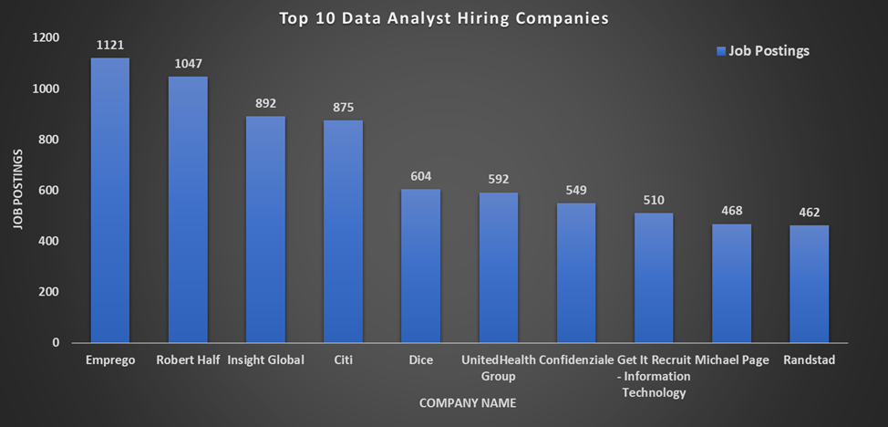
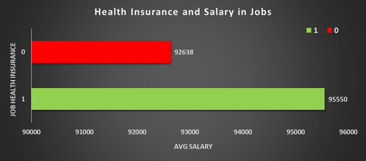

# Introduction : 
Dive into the data job market! Focusing on data analyst roles, this project explores top-paying jobs, in-demand skills, and where high demand meets high salary in data analytics.

SQL queries? Check them out here: [SQL_Project_Folder](./SQL_Project.sql)

# Background :
Driven by a quest to navigate the data analyst job market more effectively, this project was born from a desire to pinpoint top-paid and in-demand skills, and others work to find optimal jobs.

### The questions I wanted to answer through my SQL queries were:

1. Which companies are hiring the most Data Analysts?
2. Which companies are hiring the most Data Analysts for remote roles?
3. Which countries have the highest average salary for Data Analysts?
4. Do jobs that mention health insurance offer higher salaries?
5. Is there a difference in pay between full-time and contract data analyst jobs?
6. How many remote Data Analyst jobs are available compared to on-site jobs?
7. What is the trend in job postings over time for Data Analyst roles?
8. What job locations offer the highest average salaries for Data Analyst roles?
9. What job types (schedule) are most common for Data Analyst roles, and how do they relate to salary?
10. How frequently is a degree NOT required in Data Analyst job postings?
11. What percentage of Data Analyst jobs explicitly mention a degree requirement?
12. Do remote (work-from-home) Data Analyst jobs offer better salaries than on-site jobs?
13. Which tools are associated with higher salaries higher average salaries?
14. Which tools (e.g., Tableau vs Power BI) are linked with higher average salaries?
15. How do job titles (seniority levels) impact average salaries in data analyst roles?
16. What are the top-paying data analyst jobs?
17. What skills are required for these top-paying jobs?
18. What skills are most in demand for data analysts?
19. Which skills are associated with higher salaries?
20. What are the most optimal skills to learn?

# Tools I Used :
For my deep dive into the data analyst job market, I harnessed the power of several key tools:

- **SQL:** The backbone of my analysis, allowing me to query the database and unearth critical insights.
- **Oracle SQL Developer:** The chosen database management system, ideal for handling the job posting data. 
- **Git & GitHub:** Essential for version control and sharing my SQL scripts and analysis, ensuring collaboration and project tracking.

# The Analysis :
Each query for this project aimed at investigating specific aspects of the data analyst job market. Here's how I approached each question:
### 1. Top 10 Data Analyst Hiring Companies.
#### **Summary:** 
To identify which companies have the highest volume of data analyst job postings can show where demand is concentrated.

```SQL
  SELECT 
      b.name AS company_name,
      COUNT(a.job_id) AS job_postings
  FROM 
      job_postings a
      JOIN company b ON a.company_id = b.company_id
  WHERE 
      a.job_title_short = 'Data Analyst'
  GROUP BY 
      b.name
  ORDER BY 
      job_postings DESC
  FETCH FIRST 10 ROWS ONLY;
```

#### Result :

| Company Name                                 | Job Postings |
|----------------------------------------------|--------------|
| Emprego                                      | 1121         |
| Robert Half                                  | 1047         |
| Insight Global                               | 892          |
| Citi                                         | 875          |
| Dice                                         | 604          |
| UnitedHealth Group                           | 592          |
| Confidenziale                                | 549          |
| Get It Recruit - Information Technology      | 510          |
| Michael Page                                 | 468          |
| Randstad                                     | 462          |

Here's the breakdown of the companies have the highest data analyst job posting:
- **Top Hiring Companies:** Employers like Emprego, Robert Half, and Insight Global lead in the number of Data Analyst job postings, indicating a strong demand for analytics talent.
- **Job Search Tip:** Companies with lots of job posts, like Emprego and Insight Global, are good targets—they often hire for many roles and may have ongoing openings.



*Bar graph visualizing the job posting for the top 10 salaries for data analysts; this graph is generated in excel from my SQL query results*

### 2. Top 10 Data Analyst Remote Roles Hiring Companies.
#### **Summary:** 
This analysis identifies which companies are leading in offering remote data analyst roles, providing insight into remote-friendly employers.

```SQL
  SELECT 
      c.name AS company_name,
      COUNT(j.job_id) AS remote_job_count
  FROM 
      job_postings j
  JOIN 
      company c ON j.company_id = c.company_id
  WHERE 
      j.job_title_short = 'Data Analyst'
      AND j.job_work_from_home = 'TRUE'
  GROUP BY 
      c.name
  ORDER BY 
      remote_job_count DESC
  FETCH FIRST 10 ROWS ONLY;
```

#### Result :

| Company Name                              | Remote Job Count |
|-------------------------------------------|------------------|
| Get It Recruit - Information Technology   | 488              |
| Dice                                      | 260              |
| Peroptyx                                  | 179              |
| TELUS International AI Data Solutions     | 161              |
| Crossover                                 | 119              |
| TELUS International                       | 118              |
| Insight Global                            | 98               |
| Robert Half                               | 90               |
| Talentify.io                              | 76               |
| Get It Recruit - Finance                  | 56               |

Here's the breakdown of the companies have the highest data analyst Remote job posting:
- **Top Remote Employers:** Companies like "Get It Recruit," "Dice," and "Peroptyx" offer the highest number of remote Data Analyst jobs.
- **Helpful for Job Seekers:** If you're looking for remote work, focusing on these companies can improve your chances of finding flexible job options.


*Bar graph visualizing the jon count for the top 10 salaries for data analysts (remote); this graph is generated in excel from my SQL query results*

### 3. Top 10 Countries with the Most Data Analyst Hiring Companies.
#### **Summary:** 
This question surfaces geographic regions where data analysts are paid the most, helping candidates and companies understand market rates.

```SQL
  SELECT 
      job_country,
      ROUND(AVG(salary_year_avg), 0) AS avg_salary
  FROM 
      job_postings
  WHERE 
      job_title_short = 'Data Analyst'
      AND salary_year_avg IS NOT NULL
      AND job_country IS NOT NULL
  GROUP BY 
      job_country
  ORDER BY 
      avg_salary DESC
  FETCH FIRST 10 ROWS ONLY;
```

#### Result :

| Job Country                      | Avg Salary |
|----------------------------------|------------|
| Belarus                          | 400000     |
| Namibia                          | 135000     |
| Chile                            | 127250     |
| South Korea                      | 115709     |
| U.S. Virgin Islands              | 115000     |
| Malta                            | 113513     |
| Greece                           | 111683     |
| Congo, Democratic Republic of the| 111175     |
| Nicaragua                        | 111175     |
| Finland                          | 108110     |

Here's the breakdown of the Job Country have the highest Avg Salary:
-	**Top Countries:** Countries like Belarus, Namibia, and Chile show very high average salaries for Data Analyst roles, which might be due to a small number of high-paying job postings.
- **Remote Job Possibility:** Some of these roles may be remote or posted by international companies, which could explain the higher salaries in unexpected countries.
- **For Job Seekers:** This information is useful for those looking for remote work or exploring opportunities in different countries.


*Bar graph visualizing the salary for the Top 10 Countries with the Most Data Analyst Hiring Companies; this graph is generated in excel from my SQL query results*

### 4. Health Insurance and Salary in Jobs.
#### **Summary:** 
This query investigates whether jobs that offer benefits like health insurance and also provide higher salaries.

```SQL
  SELECT 
      job_health_insurance,
      ROUND(AVG(salary_year_avg), 0) AS avg_salary
  FROM 
      job_postings
  WHERE 
      job_title_short = 'Data Analyst'
      AND salary_year_avg IS NOT NULL
  GROUP BY 
      job_health_insurance;
```

#### Result :

| Job Health Insurance | Avg Salary |
|----------------------|------------|
| TRUE                 | 95550      |
| FALSE                | 92638      |


Here's the breakdown of the Health Insurance and Salary in Jobs:
-	**Pay:** Jobs that offer health insurance tend to have a higher average salary ($95,550) compared to those without it ($92,638). This suggests that roles with health insurance might also come with better pay.
- **Employer Commitment:** Companies that provide health insurance may be more committed to attracting and retaining talent, offering additional benefits to employees.



*Bar graph visualizing the salary for the Health Insurance and Salary in Jobs; this graph is generated in excel from my SQL query results*

### 5. Top job types to understand how employment structure.
#### **Summary:** 
This analysis compares job types: full-time, contract, Part-time, Internship to understand how employment structure affects compensation.

```SQL
  SELECT 
      job_schedule_type,
      ROUND(AVG(salary_year_avg), 0) AS avg_salary
  FROM 
      job_postings
  WHERE 
      job_title_short = 'Data Analyst'
      AND salary_year_avg IS NOT NULL
      AND job_schedule_type IS NOT NULL
  GROUP BY 
      job_schedule_type
  ORDER BY 
      avg_salary DESC;
```

#### Result :

| Job Schedule Type                          | Avg Salary |
|--------------------------------------------|------------|
| Full-time and Part-time                    | 101731     |
| Full-time                                  | 94390      |
| Full-time, Contractor, and Temp work       | 86500      |
| Contractor                                 | 85217      |
| Full-time and Per diem                     | 82011      |
| Full-time and Contractor                   | 79017      |
| Contractor and Temp work                   | 78750      |
| Part-time                                  | 75677      |
| Full-time and Temp work                    | 73819      |
| Full-time, Part-time, and Contractor       | 70000      |
| Temp work                                  | 70000      |
| Full-time, Temp work, and Internship       | 67818      |
| Internship                                 | 65925      |
| Full-time, Contractor, and Internship      | 65000      |
| Full-time and Internship                   | 63750      |
| Part-time and Contractor                   | 60734      |
| Part-time and Full-time                    | 54000      |
| Internship and Full-time                   | 50400      |


*Bar graph visualizing the salary for the Top job types to understand how employment structur; this graph is generated in excel from my SQL query results*

Here's the breakdown of the job types to understand how employment structure:
-	**Mixed Schedules Can Pay More:** Roles that offer both full-time and part-time options have the highest average salary ($101,731), showing that flexible job types may come with better pay.
- **Full-Time Is Still Strong:** Standard full-time roles pay well ($94,390 on average), offering a balance of good income and job stability.
- **Contract and Temp Work Varies:** Contractor and temporary roles often offer decent pay but may lack benefits like health insurance or job security.
- **Internships and Part-Time Pay Less:** Internship and part-time roles are generally at the lower end of the salary range, likely due to less experience or fewer hours.
- **Choose What Fits Best:** Job seekers should consider both pay and job type. Some roles pay more but may be less stable, while others offer steady income with benefits.

### 6. Availability of Work From Home in data analyst roles.
#### **Summary:** 
This analysis helps the availability of remote work in data analyst roles in the post-pandemic workforce.

```SQL
  SELECT 
      job_work_from_home,
      COUNT(job_id) AS job_count
  FROM 
      job_postings
  WHERE 
      job_title_short = 'Data Analyst'
  GROUP BY 
      job_work_from_home;
```

#### Result :

| Work From Home | Job Count |
|----------------|-----------|
| TRUE           | 13331     |
| FALSE          | 183262    |

Here's the breakdown of the Availability of Work From Home in data analyst roles:
- **Mostly On-Site Jobs:** The majority of Data Analyst jobs (183,262) are not work-from-home, while only a smaller portion (13,331) are remote.
- **Remote Options Exist:** Even though fewer, remote jobs are still available, giving some flexibility for people who prefer to work from home.
- **Job Seekers Can Choose:** Knowing the number of remote roles helps job seekers decide if they want to focus on local jobs or look for remote opportunities.


*Bar graph visualizing the job count for the Availability of Work From Home in data analyst roles; this graph is generated in excel from my SQL query results*

### 7. Top 30 Trend in job postings over time for Data Analyst roles.
#### **Summary:** 
This query reveals temporal trends in Data Analyst job demand, useful for identifying hiring cycles and market seasonality.

**Query-1: With Day/month/year.
```SQL
  SELECT                                                                                                         
      TO_CHAR(JOB_POSTED_DATE, 'DD-MM-YYYY') AS posting_month,
      COUNT(job_id) AS posting_count
  FROM 
      job_postings
  WHERE 
      job_title_short = 'Data Analyst'
  GROUP BY 
      TO_CHAR(JOB_POSTED_DATE, 'DD-MM-YYYY')
  ORDER BY 
      posting_count DESC
      FETCH FIRST 25 ROWS ONLY;
```

#### Result :

| Posting Month | Posting Count |
|--------------|---------------|
| 04-01-2023   | 1087          |
| 20-01-2023   | 968           |
| 26-01-2023   | 926           |
| 01-01-2023   | 906           |
| 11-01-2023   | 889           |
| 09-02-2023   | 880           |
| 19-01-2023   | 878           |
| 25-01-2023   | 858           |
| 10-01-2023   | 857           |
| 09-11-2023   | 856           |
| 01-09-2023   | 854           |
| 27-01-2023   | 841           |
| 06-01-2023   | 836           |
| 05-01-2023   | 818           |
| 18-01-2023   | 798           |
| 13-01-2023   | 795           |
| 24-01-2023   | 791           |
| 24-08-2023   | 789           |
| 12-01-2023   | 788           |
| 31-08-2023   | 787           |
| 31-01-2023   | 785           |
| 25-08-2023   | 781           |
| 23-01-2023   | 776           |
| 02-03-2023   | 766           |
| 25-05-2023   | 754           |
| 01-08-2023   | 751           |
| 01-02-2023   | 748           |
| 18-08-2023   | 748           |
| 09-01-2023   | 747           |
| 19-09-2023   | 746           |


*Time-Series visualizing the posting count for the Top 30 Trend in job postings over time for Data Analyst roles; this graph is generated in excel from my SQL query results*

**Query-2: With month only.
```SQL
   SELECT 
      TO_CHAR(JOB_POSTED_DATE, 'Month') AS month,
      COUNT(job_id) AS job_count
  FROM 
      job_postings
  WHERE 
      job_title_short = 'Data Analyst'
  GROUP BY 
      TO_CHAR(JOB_POSTED_DATE, 'Month')
  ORDER BY 
      job_count DESC;
```

#### Result :

| Posting Month | Posting Count |
|---------------|---------------|
| January       | 23697         |
| August        | 18602         |
| February      | 16479         |
| March         | 16342         |
| October       | 16260         |
| July          | 16150         |
| June          | 15932         |
| April         | 15499         |
| November      | 15133         |
| September     | 14997         |
| December      | 14045         |
| May           | 13457         |

Here's the breakdown of the Trend in job postings over time for Data Analyst roles:
- **Hiring Peaks in January:** Most job postings for Data Analyst roles were made in January 2023, showing it's a busy month for hiring.
- **Other Active Months:** February, August, and September also had high posting days, suggesting more openings in early and mid-year.
- **Good to Know for Job Seekers:** If you're planning to apply, targeting these peak times can increase your chances of finding more opportunities.


*Bar graph visualizing the posting count for the Trend in job postings over time for Data Analyst roles; this graph is generated in excel from my SQL query results*

### 8. Top 10 Job locations that have highest average salaries for Data Analyst roles.
#### **Summary:** 
This analysis uncovers geographic hotspots for high-paying Data Analyst roles, guiding job seekers toward lucrative regions.

```SQL
  SELECT 
      job_location,
      ROUND(AVG(salary_year_avg), 0) AS avg_salary
  FROM 
      job_postings
  WHERE 
      job_title_short = 'Data Analyst'
      AND salary_year_avg IS NOT NULL
  GROUP BY 
      job_location
  ORDER BY 
      avg_salary DESC
      FETCH FIRST 10 ROWS ONLY;
```

#### Result : Top 10 Average Salary by Job Location.

| Job Location              | Avg Salary |
|---------------------------|------------|
| Belarus                   | 400000     |
| Berkeley Heights, NJ      | 200000     |
| Merced, CA                | 200000     |
| Hildesheim, Germany       | 200000     |
| Nea Smyrni, Greece        | 200000     |
| Renningen, Germany        | 199838     |
| South San Francisco, CA   | 182771     |
| Taipei, Taiwan            | 180000     |
| Valparaiso, IN            | 173500     |
| Saratoga, CA              | 170000     |

Here's the breakdown of the Job locations that have highest average salaries for Data Analyst roles:
- **Top Paying Locations:** Places like Belarus, parts of California, Germany, and Taiwan offer the highest average salaries for Data Analyst roles.
- **Not Just Big Cities:** Some smaller or unexpected locations also pay very well, showing that high salaries aren’t limited to major tech hubs.
- **Think Beyond Salary:** While these numbers are attractive, it's important to also consider the cost of living in each location when comparing offers.


*Bar graph visualizing the salary for the Top 10 Job locations that have highest average salaries for Data Analyst roles; this graph is generated in excel from my SQL query results*

### 9. Most common job types for Data Analyst roles.
#### **Summary:** 
This analysis uncovers geographic hotspots for high-paying Data Analyst roles, guiding job seekers toward lucrative regions.

```SQL
  SELECT 
      job_schedule_type,
      COUNT(job_id) AS job_count,
      ROUND(AVG(salary_year_avg), 0) AS avg_salary
  FROM 
      job_postings
  WHERE 
      job_title_short = 'Data Analyst'
      AND salary_year_avg IS NOT NULL
      AND job_schedule_type IS NOT NULL
  GROUP BY 
      job_schedule_type
  ORDER BY 
      job_count DESC;
```

#### Result : 

| Job Schedule                           | Job Count | Avg Salary |
|----------------------------------------|-----------|------------|
| Full-time                              | 5169      | 94390      |
| Contractor                             | 134       | 85217      |
| Full-time and Part-time                | 56        | 101731     |
| Part-time                              | 31        | 75677      |
| Full-time and Contractor               | 20        | 79017      |
| Full-time and Temp work                | 9         | 73819      |
| Internship                             | 8         | 65925      |
| Temp work                              | 8         | 70000      |
| Contractor and Temp work               | 4         | 78750      |
| Full-time and Internship               | 4         | 63750      |
| Full-time, Contractor, and Internship  | 3         | 65000      |
| Full-time, Contractor, and Temp work   | 2         | 86500      |
| Full-time and Per diem                 | 2         | 82011      |
| Full-time, Part-time, and Contractor   | 1         | 70000      |
| Part-time and Full-time                | 1         | 54000      |
| Full-time, Temp work, and Internship   | 1         | 67818      |
| Internship and Full-time               | 1         | 50400      |
| Part-time and Contractor               | 1         | 60734      |

Here's the breakdown of most common job types for Data Analyst roles:
- **Full-Time Leads the Market:** Most Data Analyst jobs are full-time (5,169 postings), with a strong average salary of $94,390—making it the most common and stable option.
- **Contract Work Pays Well:** Contractor roles are fewer but still offer good pay ($85,217), often due to specialized short-term projects.
- **Flexible Schedules, Higher Pay:** Some mixed schedules (like full-time and part-time) show even higher average salaries, but these are rare.
- **Choose What Fits You:** Whether you're looking for stability, flexibility, or short-term projects, there's a range of job types—each with different pay and lifestyle balance.


*Bar graph visualizing the salary for the Most common job types for Data Analyst roles; this graph is generated in excel from my SQL query results*

### 10. Is a degree required/not in Data Analyst.
#### **Summary:** 
This analysis quantifies how often data analyst jobs do not mention a degree requirement, and how that correlates with salaries.

```SQL
  SELECT 
      job_no_degree_mention,
      COUNT(job_id) AS job_count,
      ROUND(AVG(salary_year_avg), 0) AS avg_salary
  FROM 
      job_postings
  WHERE 
      job_title_short = 'Data Analyst'
      AND job_work_from_home = 'TRUE'
      AND salary_year_avg IS NOT NULL
  GROUP BY 
      job_no_degree_mention;
```

#### Result : 

| No Degree Mention | Job Count | Avg Salary |
|-------------------|-----------|------------|
| TRUE              | 114       | 103119     |
| FALSE             | 490       | 92827      |

Here's the breakdown of the degree NOT required in Data Analyst:
- **Skills Over Degrees:** Some remote Data Analyst jobs (114 postings) mention a degree requirement, showing that many companies are open to hiring based on skills instead of formal education.
- **Good Pay Without a Degree:** These no-degree jobs actually offer higher average salaries ($103,119) compared to jobs that do require a degree ($92,827).
- **Focus on What You Can Do:** Employers are placing more value on hands-on experience, technical skills, and real-world projects rather than just academic qualifications.


*Bar graph visualizing the salary Is a degree required/not in Data Analyst; this graph is generated in excel from my SQL query results*

### 11. percentage of Data Analyst jobs degree required or Not.
#### **Summary:** 
This query identifies how often employers specify a degree requirement in job postings.
```SQL
  SELECT 
      COUNT(*) AS total_jobs,
      COUNT(CASE WHEN job_no_degree_mention = 'FALSE' THEN 1 END) AS jobs_requiring_degree,
      ROUND(100.0 * COUNT(CASE WHEN job_no_degree_mention = 'FALSE' THEN 1 END) / COUNT(*), 2) AS percentage_degree,
      COUNT(CASE WHEN job_no_degree_mention = 'TRUE' THEN 1 END) AS jobs_no_degree_required,
      ROUND(100.0 * COUNT(CASE WHEN job_no_degree_mention = 'TRUE' THEN 1 END) / COUNT(*), 2) AS percentage_no_degree
  FROM 
      job_postings
  WHERE 
      job_title_short = 'Data Analyst';
```

#### Result : 

| Total Jobs | Jobs Requiring Degree | Percentage Degree | Jobs No Degree Required | Percentage No Degree |
|------------|-----------------------|-------------------|-------------------------|----------------------|
| 196593     | 120536                | 61.31%            | 76057                   | 38.69%               |

Here's the breakdown of the degree NOT required in Data Analyst:
- **No Degree? Still a Chance:** About 39% of Data Analyst jobs don’t mention a degree requirement, which is good news for self-taught professionals or those from non-traditional backgrounds.
- **Degree Still Common:** Around 61% of job postings still ask for a degree—often in areas like Computer Science, Business, or Statistics.
- **Helpful Insight:** This shows that while having a degree helps, strong skills and experience can still open many doors in the data analyst field.


*Pi chart visualizing for the percentage of Data Analyst jobs degree required or Not; this graph is generated in excel from my SQL query results*

### 12. Remote (work-from-home) Data Analyst jobs offer better salaries.
#### **Summary:** 
This comparison helps determine if remote jobs are just more flexible then office.

```SQL
  SELECT 
      job_work_from_home,
      COUNT(job_id) AS job_count,
      ROUND(AVG(salary_year_avg), 0) AS avg_salary
  FROM 
      job_postings
  WHERE 
      job_title_short = 'Data Analyst'
      AND salary_year_avg IS NOT NULL
  GROUP BY 
      job_work_from_home;
```

#### Result : 

| Work From Home | Job Count | Avg Salary |
|----------------|-----------|------------|
| TRUE           | 604       | 94770      |
| FALSE          | 4859      | 93765      |

Here's the breakdown of the remote (work-from-home) Data Analyst jobs offer better salaries:
- **Remote Pays Slightly More:** Remote Data Analyst jobs have a slightly higher average salary ($94,770) compared to on-site roles ($93,765).
- **Wider Talent Options:** Remote work allows companies to hire skilled professionals from anywhere, and analysts can access better-paying roles without moving.
- **Remote Work is Growing:** This shows that remote work is becoming a strong option for data analysts, both in terms of flexibility and pay.


*Bar graph visualizing the salary for the Remote (work-from-home) Data Analyst jobs offer better salaries; this graph is generated in excel from my SQL query results*

### 13. Which tools are associated with higher salaries.
#### **Summary:** 
This query compares ('sql', 'python', 'excel', 'tableau', 'power bi') based on how often they appear in postings and their associated average salaries.

```SQL
  SELECT 
      c.skills,
      COUNT(b.job_id) AS job_count,
      ROUND(AVG(a.salary_year_avg), 0) AS avg_salary
  FROM 
      job_postings a
      JOIN skills_job b ON a.job_id = b.job_id
      JOIN skills c ON b.skill_id = c.skill_id
  WHERE 
      job_title_short = 'Data Analyst'
      AND a.salary_year_avg IS NOT NULL
      AND c.skills IN ('sql', 'python', 'excel', 'tableau', 'power bi')
  GROUP BY 
      c.skills
  ORDER BY 
      avg_salary DESC;
```

#### Result : 

| Skills   | Job Count | Avg Salary |
|----------|-----------|------------|
| python   | 1840      | 101512     |
| tableau  | 1659      | 97978      |
| sql      | 3083      | 96435      |
| power bi | 1044      | 92324      |
| excel    | 2143      | 86419      |

Here's the breakdown of the Which tools are linked with higher salary:
- **Python Leads in Pay**: Jobs requiring Python have the highest average salary ($101,512), showing its strong value in the data analyst job market.
- **SQL Is Most Common**: SQL appears in the most job postings (3,083), making it a must-have skill for most data analyst roles.
- **Excel Still Matters**: While Excel is widely used, it's linked with lower average salaries ($86,419), suggesting it's more common in entry-level or support roles.
- **Tableau vs. Power BI**: Tableau jobs tend to offer slightly higher pay than Power BI, possibly because it's more often used in larger or more data-driven companies.
- **Skill Strategy**: Learning multiple tools boosts your chances, but focusing deeply on high-paying ones like Python or Tableau can help with better job offers and salary negotiations.


*Bar graph visualizing the salary for Which tools are associated with higher salaries; this graph is generated in excel from my SQL query results*

### 14. Which tools (e.g., Tableau vs Power BI) are linked with higher salary.
#### **Summary:** 
This query compares Tableau vs Power BI based on how often they appear in postings and their associated average salaries.

```SQL
  SELECT 
      c.skills,
      COUNT(b.job_id) AS job_count,
      ROUND(AVG(a.salary_year_avg), 0) AS avg_salary
  FROM 
      job_postings a
      JOIN skills_job b ON a.job_id = b.job_id
      JOIN skills c ON b.skill_id = c.skill_id
  WHERE 
      job_title_short = 'Data Analyst'
      AND a.salary_year_avg IS NOT NULL
      AND c.skills IN ('tableau', 'power bi')
  GROUP BY 
      c.skills
  ORDER BY 
      avg_salary DESC;
```

#### Result : 

| Skills    | Job Count | Avg Salary |
|-----------|-----------|------------|
| Tableau   | 1659      | 97978      |
| Power BI  | 1044      | 92324      |

Here's the breakdown of the Which tools (e.g., Tableau vs Power BI) are linked with higher salary:
- **Tableau Pays More:** Jobs needing Tableau have a higher average salary ($97,978) compared to Power BI ($92,324), suggesting it's more valued in certain industries or roles.
- **Power BI is Microsoft-Friendly:** Power BI is often used in companies that rely on Microsoft tools, making it widely adopted and easier to learn for those already in that environment.
- **Best of Both Worlds:** Learning both tools keeps you competitive, but getting certified or specializing in one especially Tableau can help you earn more and stand out in job applications.

_are_linked_with_higher_salary.png)

*Bar graph visualizing the salary for Which tools (e.g., Tableau vs Power BI) are linked with higher salary); this graph is generated in excel from my SQL query results*

### 15. Job titles (seniority levels) impact average salaries.
#### **Summary:** 
This analysis distinguishes salary trends across various levels from entry-level analysts to senior or lead analyst roles.

```SQL
SELECT 
    job_title_short,
    COUNT(job_id) AS job_count,
    ROUND(AVG(salary_year_avg), 0) AS avg_salary
FROM 
    job_postings
WHERE 
    job_title_short LIKE '%Analyst%' 
    AND salary_year_avg IS NOT NULL
GROUP BY 
    job_title_short
ORDER BY 
    avg_salary DESC;
```

#### Result : 

| Job Title Short       | Job Count | Avg Salary |
|-----------------------|-----------|------------|
| Senior Data Analyst   | 1132      | 114104     |
| Data Analyst          | 5463      | 93876      |
| Business Analyst      | 617       | 91071      |

Here's the breakdown of the Job titles (seniority levels) impact average salaries:
- **Higher Title = Higher Pay:** Senior Data Analysts earn more ($114,104) compared to regular Data Analysts ($93,876) and Business Analysts ($91,071), showing that experience and title matter.
- **Most Jobs Are Mid-Level:** The majority of openings are for general Data Analyst roles, making it a common entry or mid-level starting point.
- **Grow Your Skills, Grow Your Pay:** Moving up to senior roles can bring a big salary boost, so gaining experience and learning advanced skills is a smart long-term move.


*Bar graph visualizing the salary for the Job titles (seniority levels) impact average salaries; this graph is generated in excel from my SQL query results*

### 16. Top Paying Data Analyst Jobs 
#### **Summary:** 
To identify the highest-paying roles,I I filtered data analyst positions by average yearly salary and location, focusing on remote jobs. This query highlights the high paying opportunities in the field.

```SQL
  SELECT 
          job_id,
          job_title,
          job_location,
          job_schedule_type,
          salary_year_avg,
          job_posted_date
  FROM
      job_postings
  WHERE 
      job_title_short = 'Data Analyst' 
      AND
      job_location = 'Anywhere'
      AND
      salary_year_avg is not NUll
  ORDER BY 
          salary_year_avg DESC;
```

#### Result : 

| Job ID    | Job Title                                          | Job Location | Schedule Type | Salary (Year Avg) | Posted Date  |
|-----------|----------------------------------------------------|--------------|---------------|-------------------|--------------|
| 226942    | Data Analyst                                       | Anywhere     | Full-time     | 650000           | 20-02-23     |
| 547382    | Director of Analytics                              | Anywhere     | Full-time     | 336500           | 23-08-23     |
| 552322    | Associate Director- Data Insights                  | Anywhere     | Full-time     | 255829.5         | 18-06-23     |
| 99305     | Data Analyst, Marketing                            | Anywhere     | Full-time     | 232423           | 05-12-23     |
| 1021647   | Data Analyst (Hybrid/Remote)                       | Anywhere     | Full-time     | 217000           | 17-01-23     |
| 168310    | Principal Data Analyst (Remote)                    | Anywhere     | Full-time     | 205000           | 09-08-23     |
| 731368    | Director, Data Analyst - HYBRID                    | Anywhere     | Full-time     | 189309           | 07-12-23     |
| 310660    | Principal Data Analyst, AV Performance Analysis    | Anywhere     | Full-time     | 189000           | 05-01-23     |
| 1749593   | Principal Data Analyst                             | Anywhere     | Full-time     | 186000           | 11-07-23     |
| 387860    | ERM Data Analyst                                   | Anywhere     | Full-time     | 184000           | 09-06-23     |
| ...       | ...                                                | ...          | ...           | ...              | ...          |
| ...       | ...                                                | ...          | ...           | ...              | ...          |
| ...       | ...                                                | ...          | ...           | ...              | ...          |
| 663127    | Data Quality Analyst (Fraud Prevention)            | Anywhere     | Full-time     | 40000            | 26-10-23     |
| 994565    | Remote Data Analyst                                | Anywhere     | Full-time     | 39000            | 28-04-23     |
| 1349849   | Financial Data Analyst                             | Anywhere     | Full-time     | 36000            | 08-06-23     |
| 1178688   | Data Analyst                                       | Anywhere     | Contractor    | 35000            | 20-06-23     |
| 216489    | Research Scientist                                 | Anywhere     | Full-time     | 25000            | 18-07-23     |

Here's the breakdown of the top data analyst jobs in 2023:
- **Wide Salary Range :** Top 10 paying data analyst roles span from $184,000 to $650,000, indicating significant salary potential in the field.
- **Diverse Employers :** Companies like SmartAsset, Meta, and AT&T are among those offering high salaries, showing a broad interest across different industries.
- **Job Title Variety :** There's a high diversity in job titles, from Data Analyst to Director of Analytics, reflecting varied roles and specializations within data analytics.

### 17. Skills for Top-Paying Jobs
#### **Summary:** 
To understand what skills are required for the top-paying jobs, I joined the job postings with the skills data, providing insights into what employers value for high-compensation roles.

```SQL
  WITH top_paying_jobs AS
    (
        SELECT 
                a.job_id,
                a.job_title,
                b."NAME" AS company_name,
                a.salary_year_avg
        FROM
                job_postings a
                LEFT JOIN company b ON a.company_id = b.company_id
        WHERE 
                a.job_title_short = 'Data Analyst' 
                AND a.job_location = 'Anywhere'
                AND a.salary_year_avg is not NUll
                ORDER BY 
                a.salary_year_avg DESC
        FETCH FIRST 10 ROWS ONLY
     )
        SELECT 
                tpj.job_id,
                tpj.job_title,
                tpj.company_name,
                s.skills,
                tpj.salary_year_avg
        FROM 
                top_paying_jobs tpj
                INNER JOIN skills_job sj ON tpj.job_id = sj.job_id
                INNER JOIN skills s ON s.skill_id = sj.skill_id;
```

#### Result : 

| Job ID   | Job Title                          | Company Name                            | Skills      | Salary (Year Avg) |
|----------|------------------------------------|-----------------------------------------|-------------|-------------------|
| 552322   | Associate Director- Data Insights  | AT&T                                    | python      | 255829.5          |
| 552322   | Associate Director- Data Insights  | AT&T                                    | sql         | 255829.5          |
| 552322   | Associate Director- Data Insights  | AT&T                                    | r           | 255829.5          |
| 552322   | Associate Director- Data Insights  | AT&T                                    | azure       | 255829.5          |
| 552322   | Associate Director- Data Insights  | AT&T                                    | databricks  | 255829.5          |
| 552322   | Associate Director- Data Insights  | AT&T                                    | aws         | 255829.5          |
| 552322   | Associate Director- Data Insights  | AT&T                                    | powerpoint  | 255829.5          |
| 552322   | Associate Director- Data Insights  | AT&T                                    | pyspark     | 255829.5          |
| 552322   | Associate Director- Data Insights  | AT&T                                    | jupyter     | 255829.5          |
| 552322   | Associate Director- Data Insights  | AT&T                                    | excel       | 255829.5          |
| 552322   | Associate Director- Data Insights  | AT&T                                    | tableau     | 255829.5          |
| 552322   | Associate Director- Data Insights  | AT&T                                    | power bi    | 255829.5          |
| 552322   | Associate Director- Data Insights  | AT&T                                    | pandas      | 255829.5          |
| 99305    | Data Analyst, Marketing            | Pinterest Job Advertisements            | python      | 232423            |
| 99305    | Data Analyst, Marketing            | Pinterest Job Advertisements            | sql         | 232423            |
| ...      | ...                                | ...                                     | ...         | ...               |
| ...      | ...                                | ...                                     | ...         | ...               |
| ...      | ...                                | ...                                     | ...         | ...               |
| 1749593  | Principal Data Analyst             | SmartAsset                              | numpy       | 186000            |
| 1749593  | Principal Data Analyst             | SmartAsset                              | excel       | 186000            |
| 387860   | ERM Data Analyst                   | Get It Recruit - Information Technology | sql         | 184000            |
| 387860   | ERM Data Analyst                   | Get It Recruit - Information Technology | python      | 184000            |
| 387860   | ERM Data Analyst                   | Get It Recruit - Information Technology | r           | 184000            |

Here's the breakdown of the most demanded skills for the top 10 highest paying data analyst jobs in 2023:

- **SQL** is leading with a bold count of 8.
- **Python** follows closely with a bold count of 7.
- **Tableau** is also highly sought after, with a bold count of 6. Other skills like **R**, **Snowflake**, **Pandas**, and **Excel** show varying degrees of demand.

### 18. Most In-Demand Skills
#### **Summary:** 
This query helped identify the skills most frequently requested in job postings, directing focus to areas with high demand.

```SQL
  SELECT 
          skills,
          COUNT(b.job_id) AS demand_count
  FROM
          job_postings a
          INNER JOIN skills_job b ON a.job_id = b.job_id
          INNER JOIN skills c ON b. skill_id = c.skill_id
  WHERE
          job_title_short = 'Data Analyst'
          AND a.job_work_from_home = 'TRUE'
  GROUP BY
          skills
  ORDER BY
          demand_count DESC
          FETCH FIRST 5 ROWS ONLY;
```

#### Result : 

| Skills   | Demand Count |
|----------|--------------|
| SQL      | 7291         |
| Excel    | 4611         |
| Python   | 4330         |
| Tableau  | 3745         |
| Power BI | 2609         |

Here's the breakdown of the most demanded skills for data analysts in 2023
- **SQL** and **Excel** remain fundamental, emphasizing the need for strong foundational skills in data processing and spreadsheet manipulation.
- **Programming** and **Visualization Tools** like **Python**, **Tableau**, and **Power BI** are essential, pointing towards the increasing importance of technical skills in data storytelling and decision support.


*Bar graph visualizing the demand count for the Most In-Demand Skills; this graph is generated in excel from my SQL query results*

### 19. Skills with Higher Salaries
#### **Summary:** 
Exploring the average salaries associated with different skills revealed which skills are the highest paying..
```SQL
WITH skills_demand AS 
    (

       SELECT 
              b.skill_id,
              c.skills,
              COUNT(b.job_id) AS demand_count
        FROM
              job_postings a
        INNER JOIN skills_job b ON a.job_id = b.job_id
        INNER JOIN skills c ON b. skill_id = c.skill_id
        WHERE
              job_title_short = 'Data Analyst'
              AND a.job_work_from_home = 'TRUE'
              AND salary_year_avg IS NOT NULL
        GROUP BY
                b.skill_id,
                c.skills
    ),
        average_salary AS 
    (
        SELECT 
                b.skill_id,
                ROUND(AVG(salary_year_avg),0) AS Avg_Salary
        FROM
                job_postings a
        INNER JOIN skills_job b ON a.job_id = b.job_id
        INNER JOIN skills c ON b. skill_id = c.skill_id
        WHERE
                job_title_short = 'Data Analyst'
                AND a.job_work_from_home = 'TRUE' 
                AND salary_year_avg IS NOT NULL
        GROUP BY
                b.skill_id
    )
        SELECT
              skills_demand.skill_id,
              skills_demand.skills,
              demand_count,
              avg_salary
        FROM
              skills_demand
              INNER JOIN average_salary ON skills_demand.skill_id = average_salary.skill_id
        WHERE
              demand_count > 10
        ORDER BY
              avg_salary DESC,
              demand_count DESC
        FETCH FIRST 25 ROWS ONLY;
```

#### Result : 

| Skills        | Average Salary     |
|---------------|--------------------|
| pyspark       |             208172 |
| bitbucket     |             189155 |
| couchbase     |             160515 |
| watson        |             160515 |
| datarobot     |             155486 |
| gitlab        |             154500 |
| swift         |             153750 |
| jupyter       |             152777 |
| pandas        |             151821 |
| elasticsearch |             145000 |

Here's a breakdown of the results for top paying skills for Data Analysts:
- **High Demand for Big Data & ML Skills:** Top salaries are commanded by analysts skilled in big data technologies (PySpark, Couchbase), machine learning tools (DataRobot, Jupyter), and Python libraries (Pandas, NumPy), reflecting the industry's high valuation of data processing and predictive modeling capabilities.
- **Software Development & Deployment Proficiency:** Knowledge in development and deployment tools (GitLab, Kubernetes, Airflow) indicates a lucrative crossover between data analysis and engineering, with a premium on skills that facilitate automation and efficient data pipeline management.
- **Cloud Computing Expertise:** Familiarity with cloud and data engineering tools (Elasticsearch, Databricks, GCP) underscores the growing importance of cloud-based analytics environments, suggesting that cloud proficiency significantly boosts earning potential in data analytics.


*Bar graph visualizing the salary for the Skills with Higher Salaries; this graph is generated in excel from my SQL query results*

### 20. Optimal Skills for Job Market Value
#### **Summary:** 
Combining insights from demand and salary data, this query aimed to pinpoint skills that are both in high demand and have high salaries, offering a strategic focus for skill development.

```SQL
  SELECT 
          skills,
          COUNT(b.job_id) AS demand_count
  FROM
          job_postings a
          INNER JOIN skills_job b ON a.job_id = b.job_id
          INNER JOIN skills c ON b. skill_id = c.skill_id
  WHERE
          job_title_short = 'Data Analyst'
          AND a.job_work_from_home = 'TRUE'
  GROUP BY
          skills
  ORDER BY
          demand_count DESC
          FETCH FIRST 5 ROWS ONLY;
```

#### Result :

| Skill ID | Skills     | Demand Count | Average Salary     |
|----------|------------|--------------|--------------------|
| 8        | go         | 27           |             115320 |
| 234      | confluence | 11           |             114210 |
| 97       | hadoop     | 22           |             113193 |
| 80       | snowflake  | 37           |             112948 |
| 74       | azure      | 34           |             111225 |
| 77       | bigquery   | 13           |             109654 |
| 76       | aws        | 32           |             108317 |
| 4        | java       | 17           |             106906 |
| 194      | ssis       | 12           |             106683 |
| 233      | jira       | 20           |             104918 |

Here's a breakdown of the most optimal skills for Data Analysts in 2023: 
- **High-Demand Programming Languages:** Python and R stand out for their high demand, with demand counts of 236 and 148 respectively. Despite their high demand, their average salaries are around $101,397 for Python and $100,499 for R, indicating that proficiency in these languages is highly valued but also widely available.
- **Cloud Tools and Technologies:** Skills in specialized technologies such as Snowflake, Azure, AWS, and Big-Query show significant demand with relatively high average salaries, pointing towards the growing importance of cloud platforms and big data technologies in data analysis.
- **Business Intelligence and Visualization Tools:** Tableau and Looker, with demand counts of 230 and 49 respectively, and average salaries around $99,288 and $103,795, highlight the critical role of data visualization and business intelligence in deriving actionable insights from data.
- **Database Technologies:** The demand for skills in traditional and NoSQL databases (Oracle, SQL Server, NoSQL) with average salaries ranging from $97,786 to $104,534, reflects the enduring need for data storage, retrieval, and management expertise.


*Bar graph visualizing the salary for the Optimal Skills for Job Market Value; this graph is generated in excel from my SQL query results*

# What I Learned :
Throughout this adventure, I've turbocharged my SQL toolkit with some serious firepower:

- **Mastering SQL:** I’ve strengthened my SQL abilities, particularly in creating complex queries, merging tables efficiently, and using advanced techniques like WITH clauses to manage temporary tables.
- **Data Aggregation:**I’ve become adept at utilizing GROUP BY and turned aggregate functions like COUNT() and AVG() turning raw numbers into meaningful insights.
- **Real-World Problem Solving:** I’ve improved my ability to solve real-world data problems, transforming business questions into actionable SQL queries that generate clear, concise results.

# Conclusions :
## Insights
From the analysis, several general insights emerged:

1. **Top Hiring Companies for Data Analysts:** Companies like Emprego, Robert Half, and Insight Global are hiring the most data analysts.
2. **Top Remote Hiring Companies for Data Analysts:** Companies like Get It Recruit, Dice, and Peroptyx have the most remote data analyst job openings, making them great choices for flexible, work-from-home roles.
3. **Top-Paying Countries for Data Analysts:** Countries like Belarus, Namibia, and Chile offer the highest average salaries for data analysts remote roles.
4. **Health Insurance and Salary in Jobs:** Jobs that include health insurance usually pay more, showing that these roles often come with better overall benefits.
5. **Top Job Types for Data Analysts:** Jobs with mixed full-time and part-time options offer the highest pay, while full-time roles still provide strong salaries and stability.
6. **Work From Home Availability for Data Analysts:** Most data analyst jobs are on-site, but there are still remote roles available for those seeking work-from-home options.
7. **Top 30 Trend in Job Postings for Data Analysts:** Peak hiring happens in January, with more openings in February, August, and September—ideal times to apply.
8. **Top 10 Highest-Paying Locations for Data Analysts:** Belarus, California, Germany, and Taiwan offer the highest salaries.
9. **Most Common Job Types for Data Analysts:** Full-time Data Analyst roles dominate with an average pay of $94,390!, while contract jobs also pay well $85,217!
10. **Degree Not Always Required for Data Analysts:** Some Data Analyst jobs pay more $103,119, and focus on skills, not degrees, compared to degree-required roles $92,827.
11. **Data Analyst Degree Requirements:** 61% of jobs ask for a degree, but 39% don’t—proving strong skills can still land you the role.
12. **Remote Data Analyst Salaries:** Remote Data Analyst roles pay a bit more $94,770 than on-site roles $93,765 and offer more flexibility.
13. **Top Tools for Higher Salaries:** Python roles pay the most $101,512 & SQL is the most in-demand, Excel roles pay less $86,419 and Tableau pays more than Power BI.
14. **Tableau vs. Power BI Salaries:** Tableau roles pay more $97,978 than Power BI $92,324 but both skills enhance marketability.
15. **Seniority & Salaries in Data Roles:** Senior Data Analysts earn more $114,104 compared to others like Business Analyst, showing that experience increases pay.
16. **Top-Paying Data Analyst Jobs**: The highest-paying jobs for data analysts that allow remote work offer a wide range of salaries, the highest at $650,000!
17. **Skills for Top-Paying Jobs**: High-paying data analyst jobs require advanced proficiency in SQL, suggesting it’s a critical skill for earning a top salary.
18. **Most In-Demand Skills**: SQL is also the most demanded skill in the data analyst job market, thus making it essential for job seekers.
19. **Skills with Higher Salaries**: Specialized skills, such as SVN and Solidity, are associated with the highest average salaries, indicating a premium on niche expertise.
20. **Optimal Skills for Job Market Value**: SQL leads in demand and offers for a high average salary, positioning it as one of the most optimal skills for data analysts to learn to maximize their market value.

### Closing Thoughts

This project not only sharpened my SQL skills but also gave me a comprehensive understanding of the data analyst job market. The insights gained from this analysis will help me prioritize skill development and refine my job search strategy. By focusing on high-demand, high-salary skills like SQL, aspiring data analysts can increase their chances of landing top roles. This exploration emphasizes the importance of continuous learning and staying aligned with industry trends to remain competitive in the data analytics field.
